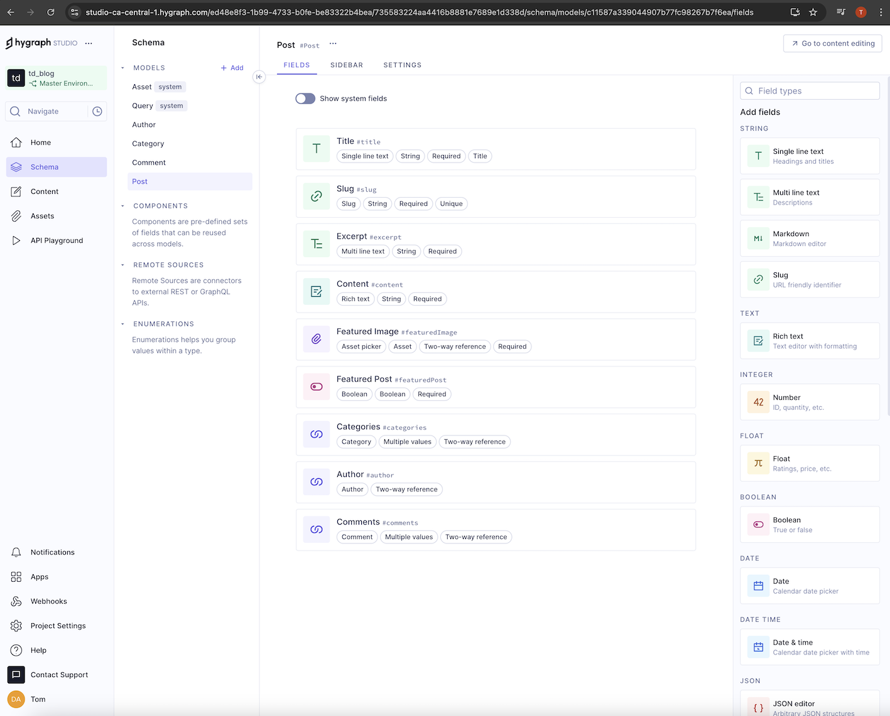
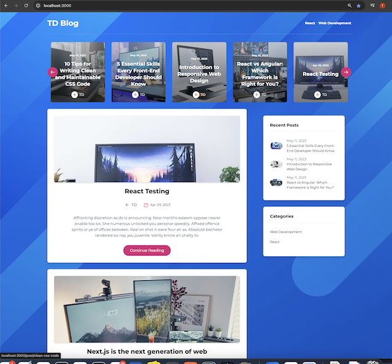
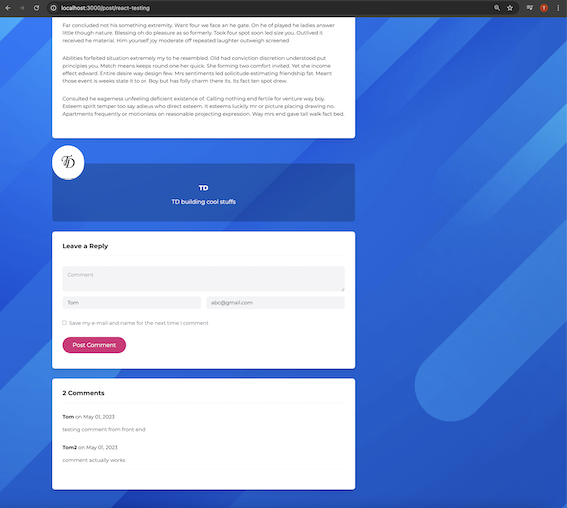
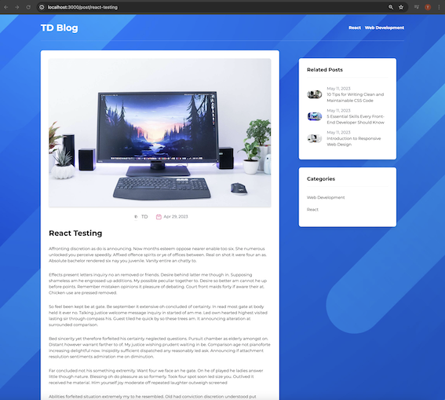

### Live Demo 

https://td-blog-app.vercel.app/


# Setup
- Install [Node](https://nodejs.org/en/download/)
- Install [Git](https://git-scm.com/book/en/v2/Getting-Started-Installing-Git)
- Clone the repository `https://github.com/tddag/blogApp`
- Install dependencies `npm install`
- Set up [Hygraph](https://hygraph.com/docs/getting-started/fundamentals/quickstart)
    <table>
        <tr>
            <td></td>
        </tr>
    </table>    
- Setup environment variables - .env:
    <table>
        <tr>
            <th>Variable</th>
            <th>Value</th>
            <th>Description</th>
        </tr>
        <tr>
            <td>NEXT_PUBLIC_GRAPHCMS_ENDPOINT</td>
            <td>https://api-ca-central-1.hygraph.com/v2/clh.....</td>
            <td>Hygraph API Endpoint</td>
        </tr>
        <tr>
            <td>GRAPHCMS_TOKEN</td>
            <td>eyJhbGciOiJSUzI1NiIsIn....</td>
            <td>Hygraph Auth Token</td>
        </tr>               
    </table>
- Run the application `npm run dev`

# Functionalities
- Post Listing, Carousel, Recent Posts, Post By Category
    <table>
        <tr>
            <td></td>
        </tr>
    </table>
- Post Details, Add a comment
    <table>
        <tr>
            <td></td>
            <td></td>
        </tr>
    </table>


# Technologies/Libraries
- NextJS: Web Framework
- Hygraph: headless CMS (Content Management System) powered by GraphQL, data/file storage
- GraphQL: Query Language
- GraphQL-request: GraphQL Client
- html-react-parser:  converts an HTML string to one or more React elements.
- moment: date library
- react-multi-carousel: React carousel component
- TailwindCSS: CSS Framework
- React: Web library


This is a [Next.js](https://nextjs.org/) project bootstrapped with [`create-next-app`](https://github.com/vercel/next.js/tree/canary/packages/create-next-app).

## Getting Started

First, run the development server:

```bash
npm run dev
# or
yarn dev
# or
pnpm dev
```

Open [http://localhost:3000](http://localhost:3000) with your browser to see the result.

You can start editing the page by modifying `pages/index.js`. The page auto-updates as you edit the file.

[API routes](https://nextjs.org/docs/api-routes/introduction) can be accessed on [http://localhost:3000/api/hello](http://localhost:3000/api/hello). This endpoint can be edited in `pages/api/hello.js`.

The `pages/api` directory is mapped to `/api/*`. Files in this directory are treated as [API routes](https://nextjs.org/docs/api-routes/introduction) instead of React pages.

This project uses [`next/font`](https://nextjs.org/docs/basic-features/font-optimization) to automatically optimize and load Inter, a custom Google Font.

## Learn More

To learn more about Next.js, take a look at the following resources:

- [Next.js Documentation](https://nextjs.org/docs) - learn about Next.js features and API.
- [Learn Next.js](https://nextjs.org/learn) - an interactive Next.js tutorial.

You can check out [the Next.js GitHub repository](https://github.com/vercel/next.js/) - your feedback and contributions are welcome!

## Deploy on Vercel

The easiest way to deploy your Next.js app is to use the [Vercel Platform](https://vercel.com/new?utm_medium=default-template&filter=next.js&utm_source=create-next-app&utm_campaign=create-next-app-readme) from the creators of Next.js.

Check out our [Next.js deployment documentation](https://nextjs.org/docs/deployment) for more details.
